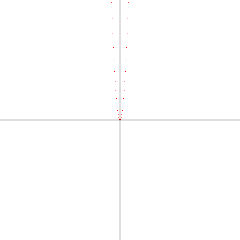

ruby-graph
==========
An experiment in graphing equations using pure Ruby.

Usage
=====
To graph, for example, `y = x^2`, setup a `RubyGraph` object and call the `graph` method.

    rg = RubyGraph.new
    rg.x_pos_offset = 20
    rg.x_neg_offset = 20
    rg.y_pos_offset = 200
    rg.y_neg_offset = 20
    rg.out_file = "graph.png"
    rg.graph { |x| (x ** 2).round }

This will output a PNG file just like the following.

