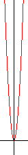

ruby-graph
==========
An experiment in graphing equations using pure Ruby.

Usage
=====
Edit the `fn()` function in `graph.rb` and run `ruby graph.rb` to generate `graph.png`.

Screenshot
==========
This is an example of graph the equation `y = x`.

